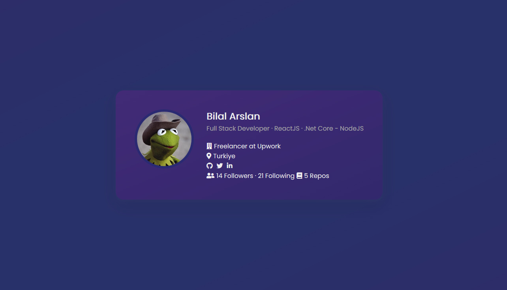
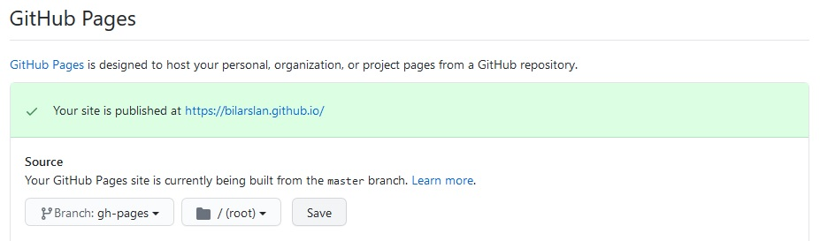

# 🌐 Github-Profile-Page

Github Pages template for personel websites


See the page in action https://bilarslan.github.io/

The theme inspered by https://uidesigndaily.com/posts/photoshop-profile-card-user-day-286

## 🧪 Requirements
· NodeJS

· Npm

## 📘 Installation

Fork the repo to your repositories.
Edit the forked repo name to YOUR_GITHUB_USERNAME.github.io

· Clone the code and edit:

in package.json:
```
"homepage": "http://YOUR_GITHUB_USERNAME.github.io",
```

in src/pages/Home.js:
```
const APIURL = githttps://api.github.com/users/YOUR_GITHUB_USERNAME

const extraData = {
        showRepoStatus: true,
        email: null, //'YOUR_EMAIL@ADDRESS',
        linkedin_url: null, //'https://www.linkedin.com/in/YOUR_LINKEDIN_USERNAME/',
};
```
· Init the project
```
npm install
```

· To test in local:
```
npm start
```

· If everthing is OK, you are ready to deploy

```
npm run deploy
```

· Add your changes
```
git add .
```

· Commit them
```
git commit -m "deploy"
```

· Push the changes
```
git push origin master
```

· In settings of the repository, change source to 'gh-pages' in GitHub Pages section and save.


· Navigate to http://YOUR_GITHUB_USERNAME.github.io and it is ready

## 📑 TODO
[x] Home Page

[ ] News Page

[ ] CV

[ ] Blog Page

## 🔧 Issues
Issues are welcome. Please create a new issue under the issues tab.

MIT Licensed


## 🔨 Contributing

Pull requests are welcome. For major changes, please open an issue first to discuss what you would like to change.


## ⚖️ License

[MIT](https://choosealicense.com/licenses/mit/)